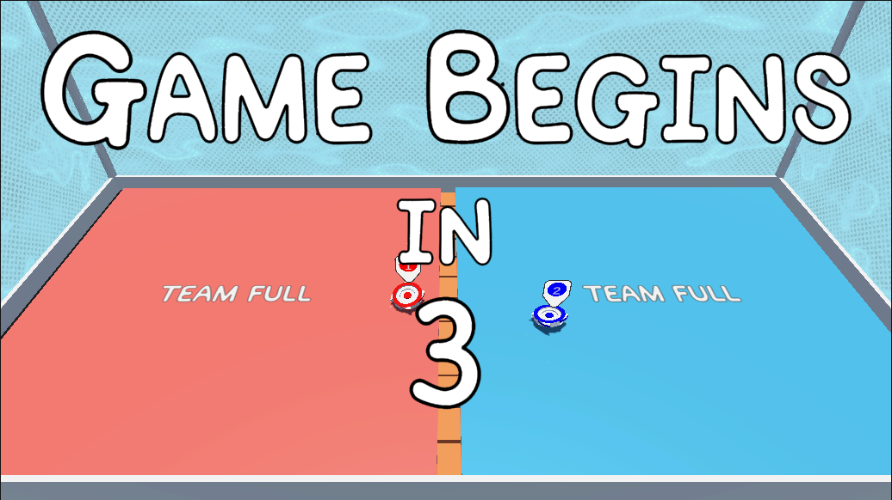
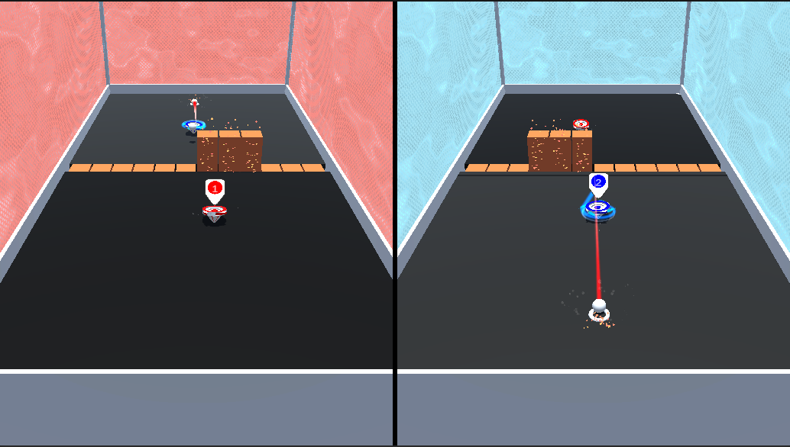
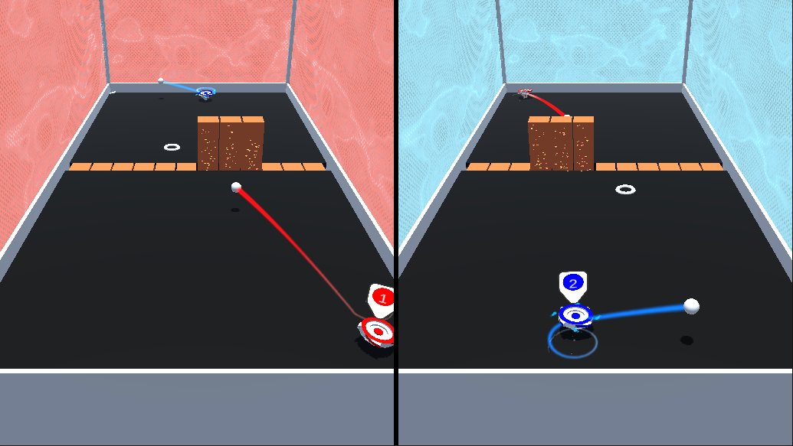

# Toopie

-----

> Programmers :
> Antony GAVELLE
> Denis PETIT
> Design&Programmers :
> Eliot PAYEN
> Thomas ANDRE
> William LHERMITTE

## Description :

The aim of this project was to do some research on the switch dev kit and develop a little game with some of its core feature. The game can handle different configuration of the switch controllers. You can play up to 4vs4 in a little "tennis" game

